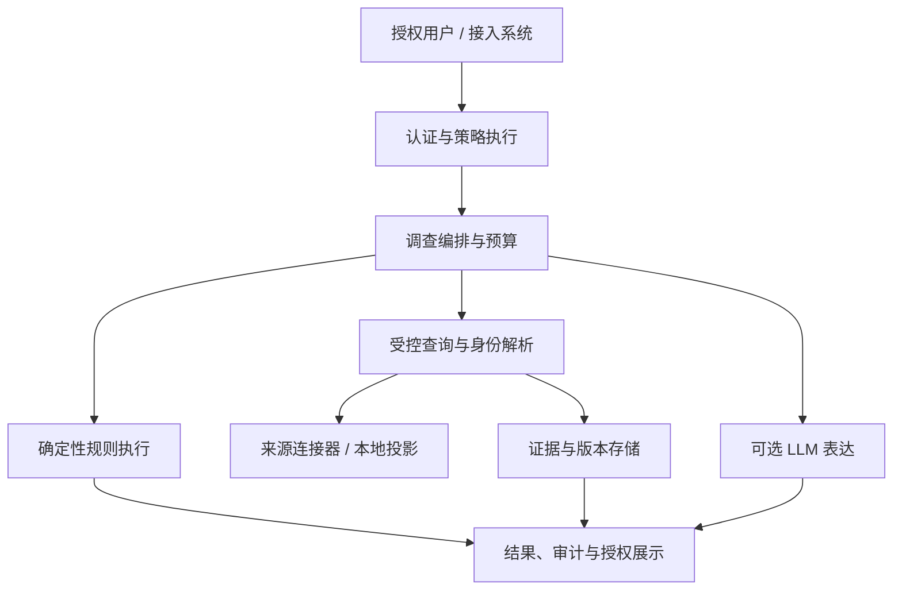

# Ontology Agent：企业业务语义与调查 Runtime 完整设计文档

> 版本：v4.0 · 日期：2026-09-24 · 状态：开发设计稿，生产使用须通过第 16 章验收。本文完整吸收原 v2 设计与 v3 生产评审，**独立可读**；实现时以本文为准。文中的订单、字段、规则、租户标识均为示例，不代表任何企业的真实退款政策。

## 0. 执行摘要与产品边界

Ontology Agent 让企业中的 Agent 在**受控、只读、可追溯**的边界内理解业务对象：先把来源系统的订单、支付和发货记录绑定到稳定实体，再取有来源和时间的事实、按已发布规则计算、输出结论与不能判断的原因。它不是通用聊天机器人，也不承诺具备完整 OWL/RDF 推理能力。LLM 可以帮助理解问句和解释既有结果，不负责决定事实、身份、权限或规则真假。

**第一版使用范围**：一个已选定企业/租户、一个经业务负责人签署的“退款资格与异常原因调查”场景；内部客服或运营发起调查，系统只给出基于所见证据的资格判断，不代替实际退款审批、支付渠道核验或执行退款。连接订单、支付、履约等经批准的权威来源；缺失、过期、冲突、未授权或来源故障时能够停止给出不可靠的肯定结论。架构保留租户标识，为未来扩展准备，但未经验收不得宣称支持任意企业、任意数据源的安全自助接入。

**设计的核心判断**：准确回答“谁、什么事实、何时成立、依据哪条规则、当前人能否看、这次调查有没有完成”。生产可用的定义不是跑通 Demo，而是一个真实业务流程在明确授权、数据质量、时效、延迟、成本、恢复和人工接管条件下可重复运行。第 16 章规定发布门槛；目前仅是设计稿，不代表代码或生产负载已验证。

### 0.1 目标与非目标

| 类别 | 第一版范围 |
| --- | --- |
| 目标 | 稳定业务身份；来源可追溯的事实和关系；版本化业务规则；授权内调查；明确不确定性；可解释证据；可审计、可观测、可回滚 |
| 支持方式 | 已登记的数据库视图/API 或受控投影；固定退款调查模板；必要的人工实体审核、规则审批和后台治理 |
| 不承诺 | 自动搭建整个企业本体、任意自由 SQL、全量图推理、跨来源强一致快照、百分之百历史重放、LLM 自主业务动作、第一版写操作 Agent |
| 后续可选 | 文档抽取、自动 Ontology Builder、跨租户联邦查询、通用本体 Studio、任意业务调查；均需重新确认来源、权限和验收条件 |

### 0.2 用户与责任

业务负责人签署业务规则、权威来源、例外和误判处理；领域专家维护 Class/Property/Relation 及实体审核；数据负责人维护来源连接、Mapping、完整性和保留；安全负责人批准字段分类、授权与模型使用边界；开发者集成 API/Tools；SRE/平台运维负责 SLO、告警、密钥、恢复与值班。业务决定“事实意味着什么”，工程保证“按同一含义正确读取和执行”；无人负责的来源或规则不得作为确定性结论依据。

## 1. 典型场景与端到端行为

**退款资格**：客服输入外部订单号 `ORDER-10001`，系统先在授权范围内定位规范订单，读取订单、支付、履约和适用政策，确定性执行退款规则，再回答“根据截至各来源的可用证据，当前是否满足某项资格，以及哪些条件满足/不满足”；返回规则版本、事实来源、读取时间、完整性与下一步。`ELIGIBLE` 不等于实际退款必然成功，支付渠道状态和政策也可能在执行前变化。

**同名客户**：多个来源都称“张某”。精确且可信的来源键优先；相似姓名、地址或向量相似度只能提出候选。高风险或有歧义的绑定进入人工队列，在确认之前不会把两人的订单混成同一客户。审核结果可撤销，历史调查依然指向当时使用的身份版本。

**跨系统差异**：ERP 为 `SHIPPED`、物流为 `IN_TRANSIT` 时，先检查两者是否描述不同属性/业务阶段；不能因为字符串不同就判定冲突，也不能简单用“来源优先级”覆盖真正不一致的同一事实。若影响资格的冲突未按业务规则解决，输出 `CONFLICT` 和受授权的双方证据。

**失败时行为**：必需来源断开、同步滞后、实体不确定、权限被撤销、预算截断或规则没有可用版本时，业务结果不被猜测。模型不可用而确定性调查完成时，改用结构化模板解释；审计无法可靠落盘时不输出确定结论。所有失败都留下可操作原因码，告警到责任人。

## 2. 概念、存储边界与时间语义

系统区分以下对象，避免把搜索命中、缓存和正式事实混为一谈。

| 名称 | 定义与边界 |
| --- | --- |
| `Ontology Schema` | Class、Property、Relation、约束及其版本，描述业务世界如何表达；不是订单当前状态 |
| `Canonical Entity` | 平台内稳定、不复用的业务对象 ID，始终附租户；不等于显示名称或外部订单号 |
| `SourceRecord` | 来源系统中的一条可定位记录或文档位置；可以暂时不绑定规范实体 |
| `IdentityBinding` | “来源记录属于某规范实体”的带状态、证据、有效期和审核人的治理判断 |
| `AssertionRevision` | 从某来源在某时刻得到的属性/关系事实修订，含来源、业务有效时间、观察时间及 Mapping 版本 |
| `CurrentProjection` | 基于修订流物化的查询视图，可重建；不会覆盖历史事实修订 |
| `Evidence` | 一次调查使用的证据定位、允许保留的值/受控快照、来源版本和访问约束 |
| `Investigation` | 一次有主体、资源预算、固定版本包、执行步骤、结果、证据和失败记录的调查 |

### 2.1 来源读取模式

`LIVE` 在调查时调用受控来源接口；`PROJECTION` 是按事件或调度同步的本地只读投影；`CACHE` 只是性能层，不构成独立事实来源；`MANUAL` 是获批用户提交并经过规定审核的断言。界面与 API 显示模式、来源、最后成功读取/同步时间及完整性；对 `LIVE` 不承诺跨系统同一时刻快照，对 `PROJECTION` 不把本地“刚读到”误写为“来源刚更新”。`MANUAL` 的权威性由属性级来源策略明确规定，不能天然覆盖系统事实。

### 2.2 事实时间及历史问题

每条事实在来源有能力提供时记录：`valid_from / valid_to`（业务有效期，采用 `[from,to)`）、`source_updated_at`、`source_version_or_position`（例如事件序号或日志位置）、`observed_at`（连接器见到）、`ingested_at`（本系统持久化）；调查另记录各来源的 `read_at`。来源不给某种时间或顺序号就标注未知，不能拿入库时间冒充业务生效时间。规则另区分 `policy_effective_at`（政策选择依据的业务时点）与 `evaluated_at`（本次判断时刻），所有日期比较明确时区、单位与边界包含方式。

历史查询需要区分“在业务时间 T 是否成立”与“系统在时间 K 当时知道什么”。只有源版本/快照与必要历史规则、Mapping 可用，才能支持 `knowledge_as_of=K` 的重算；无法还原则返回不支持或仅给**历史调查记录**，明确不等于重新计算成功。合规删除后的证据可解释性可能下降，不能假造已删除内容。

### 2.3 一致性声明

调查开始时固定已发布的 `semantic_bundle_id`：本体版本、Mapping 版本集、规则版本集、已发布授权策略版本和身份世代；对应本地投影固定批次/水位。跨来源的 Live 请求记录各自响应版本、读区间、数据水位、完整性和允许滞后，声明 `consistency_mode = BOUNDED_FRESHNESS` 及 `unified_snapshot = false`。需同一时点才能正确判断的条件，若来源没有可对齐的事件版本/快照或允许时间偏差超限，结果为不可判定。**发布策略版本固定用于解释当时规则，用户的当前访问权限仍需在读取和返回时复核**，撤权不能被旧包掩盖。单库事务隔离也需显式选择；默认逐语句快照并不足以覆盖整个多步调查，尤其无法覆盖外部来源。[PostgreSQL 事务隔离说明](https://www.postgresql.org/docs/current/transaction-iso.html)可作实现参考。

## 3. 领域模型、主键和约束

主要实体：`Tenant`、`OntologyVersion`、`ClassDefinition`、`PropertyDefinition`、`RelationTypeDefinition`、`ConstraintDefinition`、`SourceSystem`、`SourceRecord`、`Entity`、`IdentityBinding`、`AssertionRevision`、`Evidence`、`MappingDefinition`、`RuleDefinition`、`SemanticBundle`、`Investigation`、`InvestigationStep`、`AccessPolicy`、`ResourceBudget`、`AuditEvent`、`SyncCheckpoint`、`ReviewTask`。每个持久化业务实体都包含 `tenant_id`（即使首发为单租户），跨表引用用租户与对象 ID 共同校验，避免误将另一租户 ID 当作有效外键。

| 对象 | 关键字段与不可破坏的约束 |
| --- | --- |
| `Entity` | `(tenant_id, entity_id, class_id, status)`；`entity_id` 平台内稳定且永不复用；重定向/废止保留历史 |
| `SourceRecord` | `(tenant_id, source_system_id, source_record_key, locator, source_acl, source_version)`；来源键只在其命名空间内有意义 |
| `IdentityBinding` | `(source_record, entity_id, status, method, confidence, reviewer, valid_interval, revision)`；同一时间有效的冲突确认绑定受唯一/互斥约束或等价事务检查 |
| `AssertionRevision` | `(subject_entity_id, predicate_id, value/object_entity_id, source_record_id, valid_interval, source_event_id/version, mapping_version, timestamps, status)`；追加修订，当前值由投影产生 |
| `Evidence` | 来源及字段/文档位置、可访问的值或密文、读取/业务时间、源版本、Mapping 版本、分类、摘要、访问控制引用 |
| `RuleDefinition` | AST、适用 Class、所需事实、政策有效期、优先级、例外、审批者、版本与发布状态 |
| `Investigation` | 调用者、场景、对象、版本包、计划、步骤、源水位、判断/执行/质量三维状态、证据及成本、审计引用 |

规范实体 ID 的示例为 `urn:ontology-agent:t_demo:order:ent_01`；`ORDER-10001` 是 ERP 中的来源订单号。属性定义示例：`Order.status` 有类型和枚举范围、基数、敏感级别、保留类别、权威来源策略；关系 `Order.placed_by.Customer` 明确端点类、基数、逆关系和可见性。业务主键与规范 ID 的选择遵守稳定性：来源系统改号或实体合并不改变既往调查里引用的身份版本。

数据库约束覆盖：来源记录复合唯一键、幂等事件键、在有效期重叠时的绑定冲突、已发布版本不可原地修改、同一租户内引用完整性、敏感值访问限制；并发中的检查与发布在事务或具备等价一致性的操作中完成。索引以实际查询验证：`(tenant,source,record_key)`、`(tenant,entity,predicate,valid_from)`、关系两端与版本、审计按时间分区；不提前承诺特定图数据库或搜索引擎是必要条件。

## 4. 稳定身份、搜索与人工治理

身份解析顺序：①已经确认的来源记录绑定；②命名空间内唯一的来源主键；③经验证的业务唯一键；④经审核别名；⑤结构化候选检索；⑥语义检索仅辅助召回/排序；⑦必要时要求用户选择或进入人工审核。LLM 给出的 `entity_id`、`rule_id`、`property_id` 均按存在性、所属租户、版本和当前权限重新校验，候选分数不构成“同一人/同一订单”的证明。搜索先按当前权限裁候选，再排序和分页，避免候选、数量、关系另一端或定位符泄露。

绑定状态：`PROPOSED / CONFIRMED / REJECTED / REVOKED / SUPERSEDED`；存匹配方式、证据、理由、审核者、审核时间和乐观锁修订号。低风险自动确认仅适用于业务批准的确定性唯一键策略；不能因为“低置信度人工审核 SLA 到期”就自动确认。审核工作台显示队列、优先级、积压、到期与撤销；具体 4 小时/1 工作日等 SLA 须按风险、人员和业务时间确认后定版，逾期让受影响的确定结论继续保持不可判定并告警。

合并/拆分通过双人或等价受控审批、理由及影响预览执行。本地身份图写入采用治理事务/互斥和 `identity_epoch`，外部同步先进入 staging，经新身份版本重新绑定后再进入发布投影；本地锁**不能锁住外部 ERP/消息总线**。原 ID 保留别名重定向和历史图，依赖旧 ID 的投影、缓存和规则结果失效或重建；调查结束时发现与判断有关的身份世代变化，按预算重查一次或安全返回不可判定。所有动作可审计、可撤销并有恢复流程，不静默改写既往调查。

## 5. 连接器、Mapping、同步和来源完整性

连接器只操作已登记的数据库视图、参数化查询模板或批准的只读 API；实施超时、最大行数/返回字节、连接/资源限额、熔断、来源错误分类和审计，凭据放在受管秘密服务并轮换。若使用 CDC，其源端最小权限按具体产品评估；某些快照机制会要求附加写入权限，不能笼统声称“所有 CDC 都严格源端只读”，应在连接器接入评审中列明并隔离。数据源不可用、字段漂移或 ACL 缺失都不能静默产出“无记录”。

`MappingDefinition` 含来源表/视图/API、来源主键、目标 Class、Identity Key、属性/关系转换、类型/单位/时区、空值处理、权威来源、预期同步间隔、敏感分类、保留策略及版本。发布前做样例预览、类型与枚举验证、主键唯一性、空值和范围分布、关系完整性、字段 ACL 检查及差异报告。相同业务状态的不同来源若含义不同，先建不同 Property，再经批准的推导规则映射，不用字符串相似度强行合并。

**同步事件契约**：用 `(tenant_id, source_system_id, source_record_key, source_event_id 或可稳定重建的源版本, mapping_version)` 去重；如源提供单调版本/日志位置，按源顺序应用并持久化 checkpoint；没有全序时采取批次、内容哈希、回查和冲突队列，不用本地入库时间推断事实新旧。明确新增、修改、更正、撤销/删除墓碑、重复、乱序、断线重放、全量快照与增量衔接、回填重跑；`AssertionRevision` 追加，`CurrentProjection` 可以重建。人工修订使用乐观锁，**同步幂等和顺序不靠乐观锁替代**。Debezium 的 PostgreSQL 连接器文档记录故障恢复时可能重复发事件，可作实现语义参考：[官方文档](https://debezium.io/documentation/reference/stable/connectors/postgresql.html)。

每来源维护 `last_successful_sync_at`、`source_complete_until`（仅来源能证明所覆盖范围时设置）、`lag`、checkpoint、对账差异及断点恢复记录；监控来源条数/哈希抽样、孤儿绑定、删除率、失败重试和未知字段。否定事实如“没有退款记录”只有在权威来源对指定订单及时间范围承诺完整、且其水位覆盖该时段时才能作规则输入，否则只能表达“所见数据未发现”，对应资格仍可能不可判定。

新 Mapping 在隔离影子投影上完成全量回填和增量追平，比较实体数量、关键属性分布、空值、删除率、授权裁剪与调查结果；业务和数据负责人审批后按**租户/完整语义包**切换发布指针。回滚前验证旧版本仍能正确读取并覆盖所需水位；不能靠“留一周开关”推断可回滚。任何灰度期间避免新规则吃到不兼容旧映射，缓存键含租户、包版本、授权版本、投影水位和必要对象世代。

## 6. 权威来源、规则与确定性判断

权威性按**属性 × 业务时点 × 来源能力**配置，来源优先级只在业务负责人确认语义可比后起作用。同一事实的不同断言可以并存；属性解析器输出 `RESOLVED(value,evidence[]) / MISSING / STALE / CONFLICT / NOT_AUTHORIZED` 及理由，**不直接覆盖异议来源**。`NOT_AUTHORIZED` 导向访问控制失败或证据隐藏，不向无权用户泄露事实是否存在。实体级关系亦是带来源、时间、权限的事实，不只是无约束的图边。

规则采用受限的、类型化 AST：比较 `= != > >= < <= IN NOT_IN`、布尔 `AND OR NOT`、`IS_NULL`、明确时区与单位的 `DATE_DIFF`；不能执行任意 Python、SQL、JavaScript 或 LLM 生成代码。定义 `rule_id/name/applies_to/required_facts/typed_expression/priority/effective_interval/version/approval/source_evidence`，并固定对政策生效时点、边界值、覆盖关系和例外优先级的解释。退款例子可涉及“支付是否结算”“商品是否开始履约”“从哪个业务事件起算的窗口”，**窗口长短和例外条件由业务方签署**，不得从示例猜测生产政策。

单个规则条件求值 `TRUE / FALSE / UNKNOWN / CONFLICT`；`UNKNOWN` 不等于 `FALSE`，`NOT UNKNOWN` 仍未知；来源显式给出的 `NULL`、字段未返回、来源查询不完整须分别建模，`IS_NULL` 不能默认把后两者当成显式空值。对冲突值的结果只有在冲突所有可能取值均得出同一结果时才可安全收敛，否则保留冲突。整体 `INELIGIBLE` 需要一个足以否定且不会被政策例外推翻的、已授权且新鲜的确定性条件；`ELIGIBLE` 需要所有必需条件和例外检查完整且为真。缺失/过期/不完整产生不可判定，影响结果的未裁决冲突产生冲突；这比给每条规则简单三值标签更能防止误准退。规则执行器返回逐条件输入、证据、运算结果及规则版本，LLM 只能解释已经确定的结果。

规则发布需通过编译/类型检查、正反例、缺失/冲突例、跨时区与边界日期、例外覆盖、变更 diff、业务审批、历史真实样本回归与影子评估。差异报告包含业务影响样本及人工确认，禁止让 LLM 自行把制度文档改写成已发布规则。

## 7. 调查结果契约：业务、执行、质量三维分开

| 维度 | 枚举/字段 | 语义 |
| --- | --- | --- |
| 业务判断 `decision.kind` | `ELIGIBLE / INELIGIBLE / INDETERMINATE / CONFLICT / NOT_APPLICABLE` | 依据适用规则的业务判断；不使用含糊的 `NOT_CONFIRMED` |
| 执行状态 `execution.state` | `COMPLETED / PARTIAL / FAILED / CANCELLED` | 是否按计划完成；`PARTIAL` 可带超时、限额、来源故障等原因；“降级”属于此维度 |
| 证据质量 `quality` | `freshness / source_completeness / identity_status / truncated / missing_required_facts` | 告诉调用方判断基于什么覆盖范围；截断不能被当作全量查询 |

访问拒绝是 HTTP/API 安全结果，不伪装成 `INDETERMINATE`；必需审计写入失败是服务错误，不包装成正常调查。可选 LLM 文案失败而确定性主路径完成时，调查仍可 `COMPLETED`，改用模板文案并记录 `presentation_mode=TEMPLATE`。只有当业务决策表证明未读取的事实不可能影响当前结论，`PARTIAL` 才允许给出确定判断，否则 `INDETERMINATE`；冲突若影响业务判断则 `CONFLICT`。调用方始终应以 `decision.kind + execution.state + quality` 的组合展示，不单读一个状态码。

## 8. Investigation Runtime 与受控 Tool

### 8.1 执行流程

1. 认证请求，服务端建立主体、租户、用途与当前授权版本，应用租户/用户限流和请求预算；按模板解析问题与预期回答类型。对未知意图可用 LLM 辅助，但须通过类型和权限校验，低置信度要求用户确认。
2. 在**授权候选集内**解析 Anchor Entity；歧义时返回候选选择界面，不静默合并。固定语义包和身份世代、记录 `evaluated_at`、来源能力与目标一致性约束。
3. 编译受限调查计划：允许的事实、关系、已登记查询模板、最大深度/节点/行数、截止时间、成本限额；服务端策略执行器验证计划，模型不能自行扩大字段范围或生成 SQL。
4. 调用授权连接器/投影，收集来源版本和水位；校验完整性、时效、身份与冲突；只沿批准的关系边做有界遍历。每一步带请求主体、租户和用途，在服务端重新授权。
5. 按 `policy_effective_at` 选择已发布规则，确定性执行，构建证据集与三维结果；若身份/授权在调查中发生影响判断的变化，按预算重查或返回无法判断。
6. 可靠持久化调查摘要与必要审计事件，再返回 API 结果；可选的自然语言说明在剩余预算内生成，失败走结构化模板。异步调查在运行中可取消或到期，结果与历史重新读取均需鉴权。

### 8.2 Tool 列表与服务端注入的上下文

| Tool | 限定用途 |
| --- | --- |
| `resolve_entity(query, class_hint)` / `search_entities(query, filters, limit)` | 只返回当前人可见的候选、匹配原因与歧义状态，服务端设置 `limit` 上限 |
| `get_entity(entity_id, allowed_fields)` | `allowed_fields` 经服务端策略取交集，不能由模型扩权 |
| `get_assertions(entity_id, property_ids, business_as_of)` | 带来源/时间/质量；历史查询须验证来源具备历史能力 |
| `get_neighbors(entity_id, relation_ids, limit)` | 双端鉴权、受限深度，隐藏无权关系目标及数量 |
| `query_registered_template(template_id, typed_parameters)` | 仅登记查询和参数类型，注入租户与权限条件，不提供任意 SQL |
| `get_rules(entity_id, rule_scope, policy_effective_at)` / `evaluate_rule(rule_id, fact_set_id)` | 仅已发布且适用的版本；执行器验证事实 ID 与权限 |
| `get_evidence(evidence_id)` | 当前请求者再次授权、字段裁剪并审计读取 |

`tenant_id`、访问策略和连接器凭据只由服务端传递，**不出现在 Agent 可填的 Tool 参数中**。所有 LLM 生成的标识符、查询意图和候选计划通过存在性、类/版本、租户和权限校验。工具返回数据是材料，不是能修改系统指令的内容。禁止 `execute_sql(sql)`、`publish_rule`、`merge_entity`、`refund_order` 等调查工具。运营管理写入另走审核和发布 API，不复用 Agent 只读凭据。

### 8.3 资源预算、超时与取消

`ResourceBudget` 至少配置 `max_depth/max_nodes/max_relations/max_source_queries/max_rows_per_query/max_result_bytes/max_rule_evaluations/max_llm_calls/max_llm_tokens/deadline_ms` 及超限行为；按租户、用户、场景和来源做并发与速率控制。每次访问在执行前预扣配额，完成后记实际成本。超限明确标记 `PARTIAL`、`truncated=true` 或返回 `429`，不无限重试。外部请求超时小于剩余端到端 deadline；只对幂等读取做有限重试，加退避和熔断；客户端取消时传播取消，队列有长度上限与背压。

同步主路径优先保证确定性调查，可选 LLM 总结不占用业务判断所需的时限；长调查返回 `202` 与 `investigation_id`，由授权请求者查询状态。把需要长时重试的模型调用放在号称数秒完成的同步关键路径上会产生预算冲突，故将 LLM 文案移出关键路径或按很短的剩余预算执行。性能指标见第 14 章，待真实负载确认。

## 9. 授权、安全与模型数据边界

### 9.1 授权模型

使用服务端签发的 `requester/service_identity + tenant + purpose + policy_version`，策略覆盖租户、Class、Entity、Property、Relation、来源系统、来源 ACL、行过滤、敏感字段、管理操作及 Tool。认证后先裁剪可见候选，再做对象定位、关系遍历、搜索、规则证据读取；缓存命中仍按当前权限验证，缓存键包含租户和权限世代。`GET /investigations/{id}`、`GET /evidence/{id}`、导出、管理后台及向量/全文索引均执行当前请求者的授权。撤权触发索引/缓存失效或立即重新判权，旧调查不能因“当时允许”而被当前无权者查看。

来源支持“代用户”访问时按用户请求；来源只有服务账号时先最小化其源端权限，再同步来源 ACL 并在本系统以**当前授权**裁剪，不能把宽权限账号当作“用户已授权”的证明。对于用户无权看到某个实体是否存在的场景，403/404 及搜索零结果采用统一策略和展示，关系另一端、结果数量、日志和错误详情也不能泄露存在性。对来自来源系统的权限变化制定同步时效；若无法确认当前 ACL，对敏感事实拒绝确定性读取并提示负责人的内部故障码。

数据库仅执行登记视图/模板与参数化读，限制列、行、运行时间和连接数。若采用 PostgreSQL RLS 作为额外防线，运行账号不得是可绕过 RLS 的超级用户/`BYPASSRLS` 角色，表所有者须核验 `FORCE ROW LEVEL SECURITY` 等配置；连接池中的租户会话上下文在每个事务中设置并重置，开展跨请求污染测试。[PostgreSQL RLS 官方文档](https://www.postgresql.org/docs/current/ddl-rowsecurity.html)说明哪些角色可绕过策略。RLS 与应用授权共同使用，不能以其代替字段/来源/API 级策略。

### 9.2 LLM 使用与不可信输入

允许：意图候选、搜索候选辅助排序、调查计划草拟、既有判断的文字说明。禁止：自行确认合并、发布规则、决定真假、放宽权限、调用任意 SQL、把提取候选直接转成正式事实。调用超时/格式错误时最多在剩余预算内重试已明确幂等步骤，失败回退到固定模板；供应商切换也必须在相同数据分类和企业授权范围内，**不能因为主供应商不可用就把敏感数据送给另一家未经批准的模型**。

送模型前先授权、最小字段选择、去标识/遮蔽及敏感扫描；记录获批供应商、区域、模型/配置版本和请求摘要，不在普通日志保留 Prompt 全文或业务敏感值。检索片段、邮件、文档、数据库自由文本均以“引用数据”隔离，模型生成的 Tool 参数重新走确定性策略校验；针对恶意证据、越权数据外带、伪造来源和格式注入做回归攻击测试。参考 OWASP 的[提示注入](https://genai.owasp.org/llmrisk/llm01-prompt-injection/)和[敏感信息披露](https://genai.owasp.org/llmrisk/llm022025-sensitive-information-disclosure/)风险说明。

## 10. Evidence、审计、保留与删除

### 10.1 证据与可解释性

每条 Evidence 至少记录：租户、证据 ID、来源系统与记录定位（定位符本身按敏感级别控制）、字段或文件版本/页码/段落、可保留的观察值或受控密文快照、来源版本/哈希、业务有效时间、读取/入库时间、Mapping 版本、来源完整性及访问策略引用。调查保存**实际参与规则计算的事实 ID、许可范围内的快照或摘要、规则版本及逐条件结果**；展示层仅返回当前用户可见的证据片段，隐藏其他敏感字段时调整可展示的推理说明，不能从“不展示”推出该字段不存在。

“复现”分为三件事：①按当时保存的规则输入重算；②说明当时证据和执行步骤；③向现有来源重新查询。系统只承诺在保留数据与源快照能力范围内完成前两项，不把第三项描述成历史复现。对只支持 Live 当前值、已删除的原始记录或失去源版本的调查，明确 `evidence_unavailable` / `replay_not_supported` 及原因，不能生成假证据。

### 10.2 审计与隐私生命周期

系统审计流独立于调查记录，涵盖访问、权限变更、规则/Mapping 发布、身份合并拆分、凭据轮换、删除、导出和恢复操作；每条有主体、目标最小标识、时间、动作、结果、追踪 ID 与责任人，不写原始 PII。关键调查和必要审计写入有可靠持久化边界（同一事务或经验证的持久队列）；若系统无法留下必要审计，停止返回确定业务结论，给出可追踪故障。

事实修订和治理事件默认追加，不意味着敏感值永不删除。把可删除的原始值/快照与最小审计元数据分离；字段脱敏、用户/合同规定删除或保留期到期时，处理事实原值、调查正文、索引/向量、缓存、导出、副本和可控的模型供应商留存。备份按约定过期，恢复后必须重新应用删除事件；删除审计只保留不含敏感值的必要信息。若存在法定保留或合同例外，由安全/法务确认具体方案。`retention_policy` 以数据种类、租户和业务用途配置，不预设统一年限。证据被合法删除后，相关调查标记不可重放，删除动作本身受审计。

## 11. 本体、规则、Mapping 与身份版本治理

生命周期为 `DRAFT → VALIDATED → APPROVED → PUBLISHED → DEPRECATED`。草稿不改变运行结果；已发布版本不可直接原地修改。`SemanticBundle` 将一组兼容的本体、Mapping、规则及已发布策略版本绑定到一个租户发布指针，身份另有不断增长的 `identity_epoch`；本地投影与包的水位相符后才切换。一次调查固定包版本并记录执行期间身份、授权变更情况，当前权限仍实时复核。旧包可按合同/保留策略查询历史，过渡期新调查使用唯一已发布指针，破坏性变更需双版本共存、消费者迁移期限和明确下线日期。

**发布检查清单**：Class/Property/Relation 引用与类型、基数、关系端点、敏感级别和保留策略有效；Mapping 与规则兼容；变更有样本回归和影子结果对比；权限收紧时历史证据按当前策略不可越权访问；回填完成、源水位可接受、旧包可回滚；审批者不是同一操作者（按租户治理要求）；发布事件可追踪。失败时发布指针不移动，若运行中回滚则回退**完整包及兼容投影**，保留失败包、原因与审计。以 RDF 表达的实现可选 SHACL 进行约束验证，但第一版不因标准选择而强制引入图数据库。

管理端最小功能：草稿/预览/校验/审批/发布与回滚，连接器健康和来源水位，身份审核队列与撤销，规则逐条件回归差异，调查检索与按权限展示 Evidence，审计查询和告警面板。人工审核时限按风险配置和监控积压，不用过期自动确认充当自动化。

## 12. 技术架构与部署原则

逻辑组件：`Ontology Management API`、`Identity Service`、`Source Connector & Mapping`、`Assertion/Evidence Store`、`Search Service`、`Rule Compiler/Evaluator`、`Investigation Orchestrator`、`Policy Enforcement`、`Resource Budget/Rate Limiter`、`Audit & Observability`、`Web Console`。可从一个模块化服务和后台同步任务起步，不要求立即拆微服务；通过接口和版本包隔离责任。关系数据库优先存储 Schema、身份、修订、规则、调查和审计；关系遍历先用有界关系查询，搜索/向量仅辅助候选召回，缓存不当来源。FastAPI/PostgreSQL/Next.js 等均是候选，最终按既有运维、来源类型、安全及团队能力确定。



内部控制面（Schema/Mapping/规则/身份发布）与只读数据面（调查与展示）分离权限、凭据和审计；部署拓扑需包含数据库和队列备份、Secrets/KMS、网络出入口限制、审计留存、生产与测试隔离，以及受控的模型出口。连接器打到生产来源的读流量要有预估、熔断与限流，不因一次批量回填影响核心交易系统。

## 13. API 与客户端契约

外部 API 只接受类型化参数与已登记场景，OpenAPI 固定请求、响应和错误码；用户可输入业务订单号，但不得自行提交 `tenant_context`、任意 SQL、越权字段列表、已发布版本指针或来源凭据。所有查询与写入都要求身份认证、租户解析、逐资源授权、配额和审计；管理 API 有审批权限与乐观锁/幂等保护。

| 接口族 | 第一版最小接口 |
| --- | --- |
| 本体治理 | `GET /v1/ontology/versions`、`POST /v1/ontology/drafts`、`POST /v1/ontology/validate`、`POST /v1/ontology/publish` |
| 实体与证据 | `GET /v1/entities/{id}`、`GET /v1/entities/{id}/assertions`、`GET /v1/entities/{id}/relations`、`POST /v1/entities/resolve`、`POST /v1/entities/search`、`GET /v1/evidence/{id}` |
| 数据源与 Mapping | `GET /v1/datasources`、`POST /v1/datasources/{id}/test`、`POST /v1/mappings/{id}/validate`、`POST /v1/mappings/{id}/shadow-compare`、`POST /v1/mappings/{id}/publish` |
| 规则与调查 | `POST /v1/rules/{id}/evaluate`（受授权和场景约束）、`POST /v1/rules/{id}/shadow-evaluate`、`POST /v1/investigations`、`GET /v1/investigations/{id}`、`POST /v1/investigations/{id}/cancel` |
| 运维审计 | `GET /v1/health/connectors`、`GET /v1/audit-events`（仅审计角色） |

调查请求示例（`Idempotency-Key` 由客户端请求头提供，租户与身份由服务端推导）：

```json
{
  "investigation_type": "refund_eligibility",
  "anchor": {"source_system_id": "erp", "source_record_key": "ORDER-10001"},
  "question": "为什么还没有退款？现在符合退款资格吗？",
  "business_as_of": "2026-09-24T10:00:00Z"
}
```

响应示例：

```json
{
  "investigation_id": "inv_01",
  "decision": {"kind": "INDETERMINATE", "reason_codes": ["SHIPPING_SOURCE_STALE"]},
  "execution": {"state": "PARTIAL", "reason_codes": ["CONNECTOR_TIMEOUT"]},
  "quality": {
    "truncated": false,
    "source_completeness": "UNKNOWN",
    "missing_required_facts": ["shipment.status"]
  },
  "consistency": {"mode": "BOUNDED_FRESHNESS", "unified_snapshot": false},
  "semantic_bundle_id": "bundle_42",
  "identity_epoch": 8,
  "sources": [{"source_system_id": "erp", "read_at": "2026-09-24T10:00:01Z", "source_version": "rev_801"}],
  "evidence_ids": ["evi_1"],
  "presentation_mode": "TEMPLATE",
  "display_message": "发货来源的数据已超过可用时效，暂时无法确认退款资格"
}
```

`business_as_of` 默认服务端本次调查时刻；过去时点只在各权威来源可用历史版本时允许，否则 `422`。客户端传的问句不直接变成 SQL；`evidence_ids` 只包含当前用户可访问的证据，调查内部可保留更完整且更严格授权的审计引用。`sources[]` 的来源版本/水位只反映实际拿到的值，不能伪造缺失来源“最近成功时间”。`POST /investigations` 同步完成返回 `200`，异步受理返回 `202` + 状态地址；相同主体/租户的幂等键在保留窗口内返回同一次调查或等价结果，不把旧授权响应直接共享给权限已经变化的请求。

| HTTP 状态 | 场景及要求 |
| --- | --- |
| `401` | 未认证；不产生正常调查结论 |
| `403` / `404` | 无权访问；是否隐藏对象存在性按租户统一策略，避免通过搜索或引用推断 |
| `409` | 治理并发、身份/发布版本冲突；返回可处理原因码 |
| `422` | 参数错误、非法时点或不支持的历史查询 |
| `429` | 租户/用户额度用尽，返回受控重试提示 |
| `503` | 必需依赖不可用、关键审计无法持久化等，不能伪装为业务不可退款 |

## 14. 性能、成本、运维与灾难恢复

性能目标按 `investigation_type` 分层：单实体属性查询、多跳关系查询（明确最大跳数）、含规则的完整调查分别计 p50/p95/p99；队列时间、连接器读取、数据库、规则、可选模型文案分开观察。“简单查询 P95 < 800ms、多跳 < 3s、完整调查 < 5s”仅是**待验证的候选目标**，不在缺少来源耗时和真实数据量时签 SLA。按目标租户峰值并发与数据量压测，预算包括 DB 查询数/扫描行数、来源请求数、结果字节、模型 token、单次成本与租户日/月限额；超限有背压、可预期的部分结果或 `429`。

| 故障 | 用户可见行为 | 运维动作 |
| --- | --- | --- |
| LLM 超时/格式错误 | 已完成的确定性结论继续，说明用模板 | 模型错误率/成本告警，按预算熔断 |
| 非关键来源故障 | 保留有权可见的部分证据；是否有确定结论由规则充分性决定 | 记录来源故障、追查时效和重试 |
| 必需事实来源断开/过期 | `PARTIAL + INDETERMINATE` 或影响判断的 `CONFLICT`；不输出误导性肯定结果 | 告警到来源责任人，人工接管 |
| 身份/授权版本变化 | 重新校验或取消并重查；无权访问按安全错误返回 | 审计变更，清理受影响缓存 |
| 预算/截止时间到达 | 明确部分/截断；确定结论须满足充分性规则 | 限流、容量分析、必要时调整模板 |
| 审计持久化失败 | 失败响应，不给确定性业务判断 | 紧急告警、持久化恢复与事后审计 |

可观测性：每个 Investigation 有追踪 ID，Tool/来源/规则/可选 LLM 分 span；日志只存租户/调查 ID、状态、耗时、原因码、资源计量，敏感字段按默认拒绝进入日志。指标至少包括调查 p95/p99、错误确定性结论的复盘计数、`INDETERMINATE/CONFLICT/PARTIAL` 比例、来源失败与滞后/水位、实体审核积压、规则不确定率、跨租户测试、模型失败率、单次成本及队列长度；按 SLO 和故障等级配置负责人、告警阈值、值班手册，**告警阈值须由试点基线和业务影响设定**。

凭据由 Secrets/KMS 托管，连接器尽量用短期凭据和最小权限，轮换失败有告警；运行时不把密钥交给 LLM、前端或日志。备份覆盖本体/规则/Mapping、绑定及身份事件、事实修订/投影重建材料、调查、授权策略、审计和删除记录；恢复顺序保证旧删除与撤权不被备份“复活”。RPO/RTO 由业务分级批准，“RPO ≤ 1h、RTO ≤ 4h”仅作讨论目标，不是默认承诺；上线前做一次带租户隔离、权限复核和抽样证据重建的恢复演练。

## 15. 界面与运营闭环

业务界面首先回答“找到哪个对象、结论是什么、依据哪些事实、这些事实截至什么时候、哪些条件未满足/尚未确认”。不在主页面用一个绿色/红色总标签覆盖 `execution` 和 `quality`；“可能过期”“来源不可用”“还有一个人工身份审核”等应紧贴判断。事实卡可展开来源与读取时间，证据链接二次授权；调查历史按当前权限展示，保留规则与包版本。管理员可预览 Schema/Mapping/规则变更影响，处理身份审核、查看来源水位/对账差异、回滚和错误调查；SRE 面板展示 SLO、故障及人工接管路径。用户无权看某字段时，文案避免暗示字段具体值或实体存在。

运营上记录人工审核处理时间、调查采纳率、需要转人工的原因、节约的定位时间、错误确定性回答、投诉/撤销与修正规则次数；与现有人工流程作同样本对照，才能确认产品价值，不以图节点数、问答次数或模型调用次数代替业务效果。

## 16. 测试方案与生产发布门槛

### 16.1 黄金样本和故障用例

由业务方签署样本：确认可退、明确不可退、支付成功但履约不确定、未找到退款记录但来源不完整、不同来源冲突、别名/同名误匹配、部分发货、政策变更前后、跨天/时区、人工例外、删除/撤销、权限受限。每个样本标注适用政策时点、事实来源、期待的逐项条件、业务结果与允许呈现的证据。样本来自真实流程并在可用范围内去标识；无法获取真实样本时只能测软件契约，不能宣称业务正确率。

故障注入：来源超时/返回旧值/断线续传、CDC 重复乱序及墓碑、Mapping 回填期间切换、实体合并与读取并发、权限中途撤销、缓存错租户、Evidence 深链、恶意文档指令、模型伪造 ID、模型路由失败、DB 慢查询/队列耗尽、关键审计失败、备份恢复后重新应用删除事件。重点断言：**缺少会影响结论的必需事实时不发生错误确定性准退或拒退；所有已返回的确定判断有授权、适用版本、足够新鲜的证据和审计。** 对不能证明完整的“查无记录”，不得当作“确认不存在”。

### 16.2 门槛与证据

| 发布门槛 | 提交的可检查证据；任何 P0 未完成则阻断上线 |
| --- | --- |
| 业务正确性 | 黄金样本及规则回归报告、每条分歧归因与业务签字、已知误准退为零；具体样本量和误判阈值由业务风险与试点流量确定 |
| 授权与隔离 | 跨租户/跨用户、字段、搜索候选、反向关系、证据、缓存撤权、模型输入、日志和导出测试，所有高危用例无已知泄漏 |
| 同步与身份 | 重放、重复、乱序、删除、回填、灰度、合并并发和撤销通过；对账有覆盖范围、缺口告警与恢复演练 |
| 结果语义 | 不可判定、冲突、部分完成、失败、拒绝访问的 API/UI 含义一致；缺数据和故障不被转成 `INELIGIBLE` |
| 性能与成本 | 目标体量和峰值并发压测报告，p50/p95/p99、来源负载、队列长度和单位调查成本；业务/工程签署 SLO、配额和降级策略 |
| 运维与合规 | 关键故障注入、值班手册、密钥轮换、备份恢复、删除事件再应用、发布与完整包回滚演练通过 |

每份报告注明环境、版本、样本量、测试日期、失败项与负责人；“测试通过”不能只贴一个百分比。没有生产数据访问时，可交付代码、模拟环境与预生产验收报告，但不可称已验证生产可用。设计上允许内部受控试点通过后上线；扩展场景时重新跑授权、来源语义、规则回归与容量评审。

## 17. 分阶段开发与交付定义

| 阶段 | 交付范围 | 完成证据 |
| --- | --- | --- |
| 0：业务闭环 | 明确第一租户/流程、业务负责人、权威来源、字段定义、退款决策表、例外、权限、保留和模型使用边界 | 黄金样本与时效/一致性要求由业务和安全签署；否则只做 Demo |
| 1：Schema 与身份 | Class/Property/Relation、稳定 ID、来源绑定、候选审核、并发合并/拆分与身份世代 | 同名、歧义、审核、撤销、并发与历史版本测试通过 |
| 2：连接器与事实 | 受控来源读取、Mapping、事件去重/顺序/删除、双时间、投影/水位、Evidence、密钥接入 | 断线重放、对账、来源滞后标记、影子回填与回滚演练通过 |
| 3：规则引擎 | 类型化 AST、规则审批/版本、缺失冲突、边界日期与人工例外、CI 回归和影子评估 | 逐条件结果与业务签署样本一致，数据不足时不猜测 |
| 4：调查竖切 | 服务端授权、固定退款模板、受控 Tool、三维状态、预算/超时、审计、API/管理界面最小闭环 | 客服可完成只读调查、查证据、理解不确定性；故障注入通过 |
| 5：试点与治理 | 真实数据影子对比、性能/成本测量、告警与值班、删除/备份恢复、完整包灰度与回滚 | 第 16 章门槛提交可复核材料，指定内部角色受控试点 |

阶段 1—4 的组件无需按表格“每阶段一个微服务”部署；应以交付实际闭环为主。自动文档抽取与规则生成在首个生产试点后评估，生成结果只能进入候选/审核队列。

## 18. 尚待业务和企业环境确认的决策

1. 第一批用户究竟需要回答“是否符合退款资格”、诊断“为何退款未完成”，还是同时需要给人工处理建议？这三类结论的规则输入与责任边界不同。
2. 每个必需字段的权威来源、源版本/删除能力、允许时差和“无记录”完整性证明是什么？哪些数据来自 Live，哪些可建投影？
3. 政策按请求时刻、支付时刻、下单时刻或其他业务事件生效？退款窗口、部分发货、例外批准、法定/合同约束如何定义？
4. 来源能否代用户授权、ACL 撤销最长容忍时间、敏感字段分类、供应商/区域/留存和外发模型范围是什么？
5. 真实体量、峰值并发、错误结论代价、p95/p99、单次成本、审核时限、RPO/RTO、值班人员与回滚权限由谁签署？

这些答案是部署配置和业务验收输入，不用技术团队自行假定。若业务方无法给出完整性与政策语义，系统仍可作证据查找与人工辅助，但不得给出机器确定的退款资格。

## 附录 A：一个可审计的退款调查最小证据集

```text
请求：当前客服对 ERP 外部订单号 ORDER-10001 做退款资格调查
身份：来源记录 → 已确认的规范订单；记录绑定证据与 identity_epoch
授权：客服对该订单及必要支付/履约事实有访问权；敏感字段裁剪
事实：每条必需属性有来源、业务有效期、源版本、读时间和完整性
规则：命中已发布政策版本；逐项条件 TRUE/FALSE/UNKNOWN/CONFLICT
结果：业务判断 + 执行状态 + 证据质量；不把查询缺席当作肯定否定
证据：可按当前权限展开来源定位及版本；审计保留实际用过的事实 ID
失败：任何来源滞后、身份歧义、撤权或超时均有原因码与人工接管路径
```

## 附录 B：设计依据与参考

本文的产品范围、领域模型和演示场景整合自《Ontology Agent：企业业务语义与调查 Runtime 设计》v2.0；一致性、权限、同步、结果状态、验收门槛整合自《本体Agent_生产可用性评审与修订设计_v3.md》。技术参考仅支持相应实施细节，**不替代本企业的业务规则或授权决策**：[PostgreSQL 事务隔离](https://www.postgresql.org/docs/current/transaction-iso.html)、[PostgreSQL 行级安全](https://www.postgresql.org/docs/current/ddl-rowsecurity.html)、[Debezium PostgreSQL 连接器](https://debezium.io/documentation/reference/stable/connectors/postgresql.html)、[OWASP LLM 提示注入](https://genai.owasp.org/llmrisk/llm01-prompt-injection/)与[敏感信息披露](https://genai.owasp.org/llmrisk/llm022025-sensitive-information-disclosure/)。
